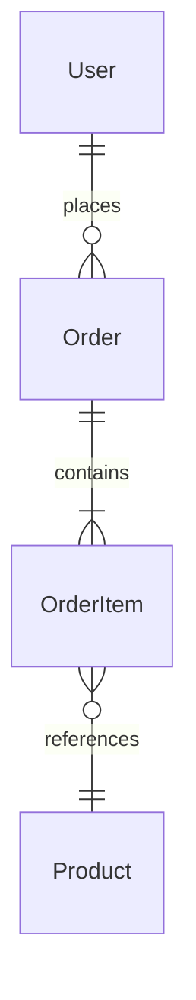
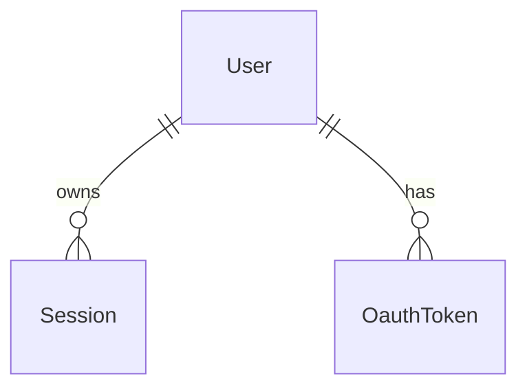
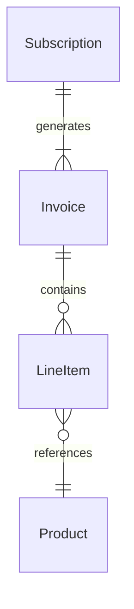

# Phase 2 — Data model

## Goal
Document every persistent data store: schemas, entities, relationships, migrations, and the validation rules that enforce data integrity.

## Prerequisite
Phase 1 architecture map (`docs/spec/01-architecture.md`) must be complete. Focus on the datastores identified in the integration boundary table.

## Steps

### 2-A  Locate schema sources of truth
Find the canonical definitions of the data model:

| Technology | Where to look |
|---|---|
| Rails / ActiveRecord | `db/schema.rb`, `db/migrate/` |
| Laravel / Eloquent | `database/migrations/`, `database/schema/` |
| Prisma | `prisma/schema.prisma` |
| TypeORM / MikroORM | Entity class files, `migrations/` |
| SQLAlchemy | `models.py`, `alembic/versions/` |
| Mongoose | Schema definition files |
| Hibernate / JPA | Entity annotations, `schema.sql` |
| Raw SQL | `*.sql` migration files, `schema.sql` |

### 2-B  Discover schema with shell commands
Before reading files manually, run the commands below to extract a structured list of tables/models and their relationships. Adjust paths to match the actual repository layout. On Windows, use Git Bash or WSL.

**Rails / ActiveRecord (`db/schema.rb`)**
```bash
# List all table names
grep -E '^\s*create_table' db/schema.rb | sed 's/.*create_table "\([^"]*\)".*/\1/' | sort

# Extract foreign key declarations
grep -E 'add_foreign_key|t\.references|_id' db/schema.rb | grep -v '^\s*#'

# Association macros in model files (adjust glob if models are nested)
grep -n "has_many\|belongs_to\|has_one\|has_and_belongs_to_many" app/models/*.rb
```

**Raw SQL / migrations (`*.sql`)**
```bash
# List table names from CREATE TABLE statements
grep -rh 'CREATE TABLE' db/ migrations/ --include='*.sql' \
  | sed 's/CREATE TABLE \(IF NOT EXISTS \)\?\([^ (]*\).*/\2/' | sort -u

# Extract FK constraints
grep -rh 'REFERENCES' db/ migrations/ --include='*.sql' | grep -v '^\s*--'
```

**Prisma (`prisma/schema.prisma`)**
```bash
# List all model names
grep '^model ' prisma/schema.prisma | awk '{print $2}' | sort

# Extract @relation fields
grep -A2 '@relation' prisma/schema.prisma
```

**Mongoose / TypeORM / generic model files**
```bash
# Find model/entity source files
find src -type f \( -name '*.model.ts' -o -name '*.entity.ts' -o -name '*Schema.ts' \) | sort

# Count them as a quick table-count proxy
find src -type f \( -name '*.model.ts' -o -name '*.entity.ts' \) | wc -l
```

Record the total table/collection count; you will need it in step 2-C.

### 2-C  Draw the ER diagram

#### Sizing rule — choose single or split layout
Count the tables/collections in the primary datastore (use the output from 2-B).

| Table count | ER layout |
|-------------|-----------|
| **≤ 20** | One `erDiagram` block covering the entire schema |
| **> 20** | One `erDiagram` block **per domain**; see splitting guidance below |

**Single diagram (≤ 20 tables)**

Produce one Mermaid `erDiagram` showing all entities and their relationships. Include cardinality notation.



**Split diagrams (> 20 tables)**

Partition entities into domains. Use the bounded-context map from Phase 1 as the first guide; fall back to table-name prefixes or directory groupings when Phase 1 boundaries are not explicit. If a domain boundary is uncertain, label it `[needs confirmation]`.

Produce one diagram section per domain, each with a heading and its own fenced `mermaid` block (do not nest fences inside a markdown code wrapper).

#### ER — Auth domain



#### ER — Billing domain  [needs confirmation]



Cross-domain foreign keys (e.g. `invoices.user_id → users.id`) should be noted as prose after the affected diagram rather than drawn across diagram boundaries, to keep each diagram self-contained.

### 2-D  Capture validation rules and reconcile with model code
For each entity, record validations that appear in the application layer (not just DB constraints):

- Presence / required fields
- Format validations (email, phone, UUID)
- Range / length constraints
- Custom validators and what they enforce
- Cross-field / cross-record rules (e.g. `end_date > start_date`)

Note which validations are enforced only in the ORM/model, and which are also enforced at the DB level.

Additionally, inspect the model/entity source files for the following ORM-level concerns that are invisible in the raw schema:

| Concern | What to look for |
|---------|-----------------|
| Scopes / query filters | Named scopes, default scopes, soft-delete filters |
| Callbacks / hooks | `before_save`, `after_create`, `@BeforeInsert` etc. that mutate data |
| Computed / virtual attributes | Properties derived from other columns at the model layer |
| Single-table inheritance (STI) | `type` column used to discriminate subclasses |
| Polymorphic associations | `*_type` / `*_id` column pairs |

Record any gap between what the schema declares and what the model layer enforces; flag it using the schema risk format defined in **2-E** below.

### 2-E  Document each entity / table
For every table or collection, produce an entity sheet using this template:

```
## <EntityName>  (<table_name>)

| Column | Type | Constraints | Notes |
|--------|------|-------------|-------|
| id     | bigint | PK, auto-increment | |
| user_id | bigint | FK → users.id, NOT NULL, index | |
| status | varchar(20) | NOT NULL, default 'pending' | enum: pending, active, cancelled |
| created_at | timestamp | NOT NULL | |

Relationships:
- belongs_to User
- has_many OrderItems

Indexes: unique(user_id, status) where status != 'cancelled'

Schema risk: <omit this line if none>
- FK user_id declared in model but missing DB-level FOREIGN KEY constraint
- `deleted_at` column present in DB but no soft-delete scope found in model
```

> **Schema risk** lines are mandatory whenever a discrepancy exists between the DB schema and the application model layer. Omit the line entirely when no issues are found — do not write "none".

### 2-F  Document enums and constants
List all enum types, constant sets, or string-typed fields with a fixed value set. Note where they are defined (DB enum, model constant, separate config file).

### 2-G  Note data lifecycle concerns
- Soft delete vs hard delete (which tables, which column)
- Archival or partitioning strategy
- Cascade rules (on delete, on update)
- Multi-tenancy isolation (if applicable)

### 2-H  Secondary datastores
If the app uses Redis, Elasticsearch, S3, or other storage beyond the primary DB:
- What is stored there and why (cache, search index, blob)?
- What is the key / naming scheme?
- What is the TTL or retention policy?

### 2-I  Save the data model document
Write `docs/spec/02-data-model.md` with all findings above, including the Mermaid ER diagram(s).

## Output checklist
- [ ] Schema source of truth identified
- [ ] Shell discovery commands run; total table count recorded
- [ ] Entity sheet for every table / collection (columns, types, constraints, schema risks flagged)
- [ ] Table count assessed; ER split into domain diagrams if count > 20
- [ ] Mermaid ER diagram(s) with cardinality notation
- [ ] Model layer reconciled with schema (scopes, callbacks, virtual attrs, STI, polymorphic)
- [ ] Validation rules per entity
- [ ] Enum and constant catalogue
- [ ] Soft-delete, cascade, and lifecycle notes
- [ ] Secondary datastore documentation
- [ ] `docs/spec/02-data-model.md` saved
