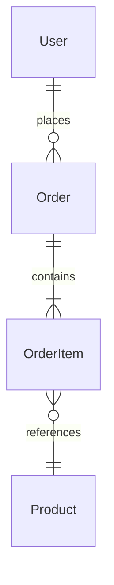

# Phase 2 — Data model

## Goal
Document every persistent data store: schemas, entities, relationships, migrations, and the validation rules that enforce data integrity.

## Prerequisite
Phase 1 architecture map (`docs/spec/01-architecture.md`) must be complete. Focus on the datastores identified in the integration boundary table.

## Steps

### 2-A  Locate schema sources of truth
Find the canonical definitions of the data model:

| Technology | Where to look |
|---|---|
| Rails / ActiveRecord | `db/schema.rb`, `db/migrate/` |
| Laravel / Eloquent | `database/migrations/`, `database/schema/` |
| Prisma | `prisma/schema.prisma` |
| TypeORM / MikroORM | Entity class files, `migrations/` |
| SQLAlchemy | `models.py`, `alembic/versions/` |
| Mongoose | Schema definition files |
| Hibernate / JPA | Entity annotations, `schema.sql` |
| Raw SQL | `*.sql` migration files, `schema.sql` |

### 2-B  Document each entity / table
For every table or collection, produce an entity sheet:

```
## <EntityName>  (<table_name>)

| Column | Type | Constraints | Notes |
|--------|------|-------------|-------|
| id     | bigint | PK, auto-increment | |
| user_id | bigint | FK → users.id, NOT NULL, index | |
| status | varchar(20) | NOT NULL, default 'pending' | enum: pending, active, cancelled |
| created_at | timestamp | NOT NULL | |

Relationships:
- belongs_to User
- has_many OrderItems

Indexes: unique(user_id, status) where status != 'cancelled'
```

### 2-C  Draw the ER diagram
Produce a Mermaid `erDiagram` showing all entities and their relationships (one-to-many, many-to-many, etc.). Include cardinality notation.



### 2-D  Capture validation rules
For each entity, record validations that appear in the application layer (not just DB constraints):

- Presence / required fields
- Format validations (email, phone, UUID)
- Range / length constraints
- Custom validators and what they enforce
- Cross-field / cross-record rules (e.g. `end_date > start_date`)

Note which validations are enforced only in the ORM/model, and which are also enforced at the DB level.

### 2-E  Document enums and constants
List all enum types, constant sets, or string-typed fields with a fixed value set. Note where they are defined (DB enum, model constant, separate config file).

### 2-F  Note data lifecycle concerns
- Soft delete vs hard delete (which tables, which column)
- Archival or partitioning strategy
- Cascade rules (on delete, on update)
- Multi-tenancy isolation (if applicable)

### 2-G  Secondary datastores
If the app uses Redis, Elasticsearch, S3, or other storage beyond the primary DB:
- What is stored there and why (cache, search index, blob)?
- What is the key / naming scheme?
- What is the TTL or retention policy?

### 2-H  Save the data model document
Write `docs/spec/02-data-model.md` with all findings above, including the Mermaid ER diagram.

## Output checklist
- [ ] Schema source of truth identified
- [ ] Entity sheet for every table / collection (columns, types, constraints)
- [ ] Mermaid ER diagram
- [ ] Validation rules per entity
- [ ] Enum and constant catalogue
- [ ] Soft-delete, cascade, and lifecycle notes
- [ ] Secondary datastore documentation
- [ ] `docs/spec/02-data-model.md` saved
