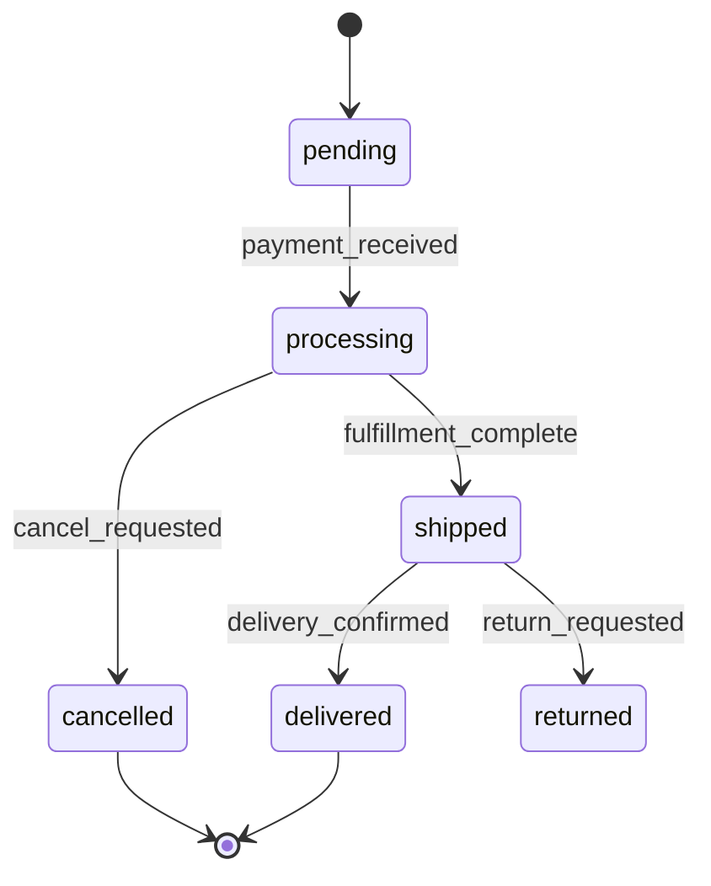

# Phase 4 — Business logic

## Goal
Explain non-trivial domain rules: pricing algorithms, permission models, state machines, multi-step workflows, background jobs, and any logic that would be opaque without documentation.

## Prerequisite
Phases 1–3 must be complete. Use the feature specifications and data model as context — Phase 4 explains the *why* and *how* behind what Phase 3 described.

## Reading and writing rules

### Framework-specific files to read (priority order)

| Framework | Priority paths |
|-----------|---------------|
| Rails | `app/services/` → `app/models/` (domain methods) → `app/jobs/` → `app/policies/` |
| Laravel | `app/Services/` → `app/Models/` → `app/Jobs/` → `app/Policies/` |
| Spring Boot | `*Service.java` → `*ServiceImpl.java` → `*Repository.java` → event listeners |
| Django / DRF | `services.py` → `models.py` (managers) → `tasks.py` (Celery) → `permissions.py` |
| FastAPI / Flask | `services/` → `models/` → `tasks/` (Celery / ARQ) → dependency providers |
| Express / Fastify / NestJS | `services/` → `*.service.ts` → `*.handler.ts` → queue processors |
| Next.js / Nuxt | `lib/` → `server/` → `api/` route handlers → `hooks/` (client-side logic) |
| PHP + Smarty | `classes/` → `lib/` → `cron/` → `includes/` (shared utilities) |
| Common | Fat controllers containing domain logic — extract and document as if they were services |

> **Read one implementation file (or one cohesive module) per pass.** Do not concatenate multiple large service files into a single turn — accuracy drops sharply.

### Information distillation policy

| Policy | How to apply |
|--------|-------------|
| Skip boilerplate | Ignore getters/setters, framework scaffolding, auto-generated code, and simple delegations |
| Extract structure | Identify the algorithm, decision tree, or state transition — not the syntax |
| Quoted source code | At most **3 consecutive lines** per snippet; summarize the rest in prose |
| Use comments | Treat inline and block comments as primary evidence for intent |

### Reading comments vs implementation

| Situation | What to do |
|-----------|-----------|
| Comment and code agree | Use the comment to write the plain-English description; no flag needed |
| Comment and code disagree | Document what the code actually does, then add: `Review needed: comment vs implementation mismatch` |
| Commented-out old code | Skip unless it explains a non-obvious constraint; if referenced, add: `Reference: legacy implementation (commented-out)` |

## Steps

### 4-A  Locate business logic code
Business logic typically lives in:
- **Service objects / use cases** (`app/services/`, `src/use-cases/`, `domain/`)
- **Model / entity methods** (fat models, domain methods on entities)
- **Domain events and handlers**
- **Policy / ability classes** (Pundit, CanCanCan, CASL, custom)
- **Background jobs / workers** (`app/jobs/`, `workers/`, `queues/`)
- **Scheduled tasks / cron** (Sidekiq-Cron, node-cron, APScheduler, `crontab`)
- **Calculation / pricing modules**

List every file that contains non-trivial logic (exclude simple CRUD).

### 4-B  Document core domain rules
For each business rule, write a rule card:

```
## Rule: <Name>

**Where in code:** `app/services/order_pricing.rb:42`
**Trigger:** When is this rule evaluated?

### Logic
Plain-English description of the rule. Be precise about conditions, formulas, and edge cases.

Example:
> Discount is applied only when `order.subtotal >= 5000` AND the user's account is not flagged.
> Discount rate = `coupon.rate` capped at 30%. Free shipping is added when the discounted
> total exceeds 3000.

### Inputs
- `order` (Order entity)
- `coupon` (Coupon entity, optional)

### Outputs / mutations
- Returns decorated order with `discount_amount` and `shipping_cost` set

### Known edge cases
- Zero-quantity items are excluded from subtotal before threshold check
- Stacked coupons are rejected — only the first coupon in the array is applied
```

### 4-C  Document state machines
For every entity with a `status` or `state` column, draw the state machine:



Note: which transitions are allowed, which events trigger them, and what side effects occur on each transition.

### 4-D  Document permission / authorisation model
- What roles exist? How are they assigned?
- What resources can each role access or mutate?
- Is authorisation attribute-based (ABAC) or role-based (RBAC)?
- Where are permission checks enforced? (controller, service, query scope)
- Are there row-level / record-level restrictions?

Produce a permission matrix if roles × actions × resources is manageable:

| Role | Order (read) | Order (create) | Order (cancel) | Admin panel |
|------|-------------|----------------|----------------|-------------|
| Guest | Own only | Yes | No | No |
| Customer | Own only | Yes | Own + within 1h | No |
| Admin | All | Yes | All | Yes |

### 4-E  Document background jobs and scheduled tasks
For each job or scheduled task:

```
## Job: <ClassName>

**Queue:** default / critical / low
**Schedule:** every 5 minutes / daily at 02:00 UTC / on-demand
**Trigger:** How is it enqueued? (event, API call, cron)

### What it does
Plain-English description.

### Inputs / arguments
### Idempotency
Is the job safe to run twice? How is duplicate execution prevented?

### Failure handling
- Retry count and backoff strategy
- Dead-letter queue / alert on exhaustion?
- Partial failure: does it commit partial results?
```

### 4-F  Document external integrations in depth
For each third-party service called by business logic (not just listed):
- What triggers the call?
- What data is sent and received?
- How are API errors handled?
- Is there a circuit breaker or fallback?

### 4-F-bis  Output template: service class or cohesive module

For each service class or cohesive module identified in 4-A, emit one section using this template. Omit any field that does not apply — do not write "N/A" or empty placeholders.

```
## Service: <ClassName or module name>

**Where in code:** `path/to/file.rb` (or relevant line range)
**Role:** One-sentence summary of what this class is responsible for.

### `methodName()`
**Inputs:** list of parameters with types
**Processing summary:**
  1. Step one
  2. Step two
**Return value:** what is returned or yielded
**Side effects:** DB writes, events published, external calls, cache changes
**Callers:** known call sites (controller, job, other service)
**Error handling:** exceptions raised or rescue blocks
**Information from comments:** intent or constraints not obvious from code alone

Review needed: comment vs implementation mismatch   ← include only if applicable
Reference: legacy implementation (commented-out)    ← include only if applicable
```

### 4-G  Save the business logic document
Write `docs/spec/04-business-logic.md` with all findings above.

## Output checklist
- [ ] Distillation rules followed (no boilerplate dumps; code quotes ≤ 3 consecutive lines per snippet)
- [ ] Comment vs code mismatches flagged with `Review needed: comment vs implementation mismatch`
- [ ] Business logic file inventory
- [ ] Rule card for each core domain rule
- [ ] State machine diagrams (Mermaid) for stateful entities
- [ ] Permission / authorisation model and matrix
- [ ] Job and scheduled task cards
- [ ] External integration depth documentation
- [ ] `docs/spec/04-business-logic.md` saved
