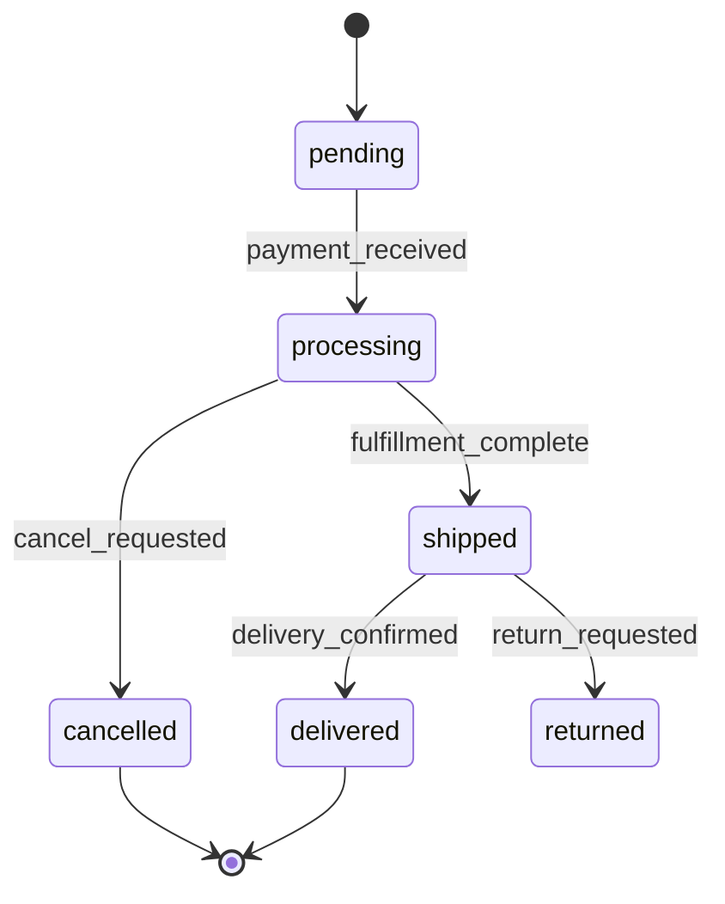

# Phase 4 — Business logic

## Goal
Explain non-trivial domain rules: pricing algorithms, permission models, state machines, multi-step workflows, background jobs, and any logic that would be opaque without documentation.

## Prerequisite
Phases 1–3 must be complete. Use the feature specifications and data model as context — Phase 4 explains the *why* and *how* behind what Phase 3 described.

## Steps

### 4-A  Locate business logic code
Business logic typically lives in:
- **Service objects / use cases** (`app/services/`, `src/use-cases/`, `domain/`)
- **Model / entity methods** (fat models, domain methods on entities)
- **Domain events and handlers**
- **Policy / ability classes** (Pundit, CanCanCan, CASL, custom)
- **Background jobs / workers** (`app/jobs/`, `workers/`, `queues/`)
- **Scheduled tasks / cron** (Sidekiq-Cron, node-cron, APScheduler, `crontab`)
- **Calculation / pricing modules**

List every file that contains non-trivial logic (exclude simple CRUD).

### 4-B  Document core domain rules
For each business rule, write a rule card:

```
## Rule: <Name>

**Where in code:** `app/services/order_pricing.rb:42`
**Trigger:** When is this rule evaluated?

### Logic
Plain-English description of the rule. Be precise about conditions, formulas, and edge cases.

Example:
> Discount is applied only when `order.subtotal >= 5000` AND the user's account is not flagged.
> Discount rate = `coupon.rate` capped at 30%. Free shipping is added when the discounted
> total exceeds 3000.

### Inputs
- `order` (Order entity)
- `coupon` (Coupon entity, optional)

### Outputs / mutations
- Returns decorated order with `discount_amount` and `shipping_cost` set

### Known edge cases
- Zero-quantity items are excluded from subtotal before threshold check
- Stacked coupons are rejected — only the first coupon in the array is applied
```

### 4-C  Document state machines
For every entity with a `status` or `state` column, draw the state machine:



Note: which transitions are allowed, which events trigger them, and what side effects occur on each transition.

### 4-D  Document permission / authorisation model
- What roles exist? How are they assigned?
- What resources can each role access or mutate?
- Is authorisation attribute-based (ABAC) or role-based (RBAC)?
- Where are permission checks enforced? (controller, service, query scope)
- Are there row-level / record-level restrictions?

Produce a permission matrix if roles × actions × resources is manageable:

| Role | Order (read) | Order (create) | Order (cancel) | Admin panel |
|------|-------------|----------------|----------------|-------------|
| Guest | Own only | Yes | No | No |
| Customer | Own only | Yes | Own + within 1h | No |
| Admin | All | Yes | All | Yes |

### 4-E  Document background jobs and scheduled tasks
For each job or scheduled task:

```
## Job: <ClassName>

**Queue:** default / critical / low
**Schedule:** every 5 minutes / daily at 02:00 UTC / on-demand
**Trigger:** How is it enqueued? (event, API call, cron)

### What it does
Plain-English description.

### Inputs / arguments
### Idempotency
Is the job safe to run twice? How is duplicate execution prevented?

### Failure handling
- Retry count and backoff strategy
- Dead-letter queue / alert on exhaustion?
- Partial failure: does it commit partial results?
```

### 4-F  Document external integrations in depth
For each third-party service called by business logic (not just listed):
- What triggers the call?
- What data is sent and received?
- How are API errors handled?
- Is there a circuit breaker or fallback?

### 4-G  Save the business logic document
Write `docs/spec/04-business-logic.md` with all findings above.

## Output checklist
- [ ] Business logic file inventory
- [ ] Rule card for each core domain rule
- [ ] State machine diagrams (Mermaid) for stateful entities
- [ ] Permission / authorisation model and matrix
- [ ] Job and scheduled task cards
- [ ] External integration depth documentation
- [ ] `docs/spec/04-business-logic.md` saved
